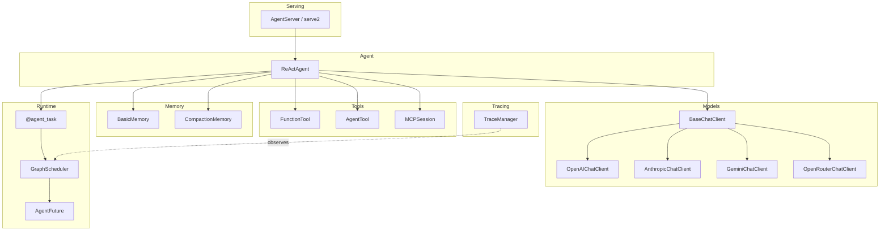

# Architecture Overview

Motus has five core modules that compose into a full agent stack.

```python
from motus.agent import ReActAgent
from motus.models import OpenAIChatClient
from motus.memory import CompactionMemory

def get_weather(city: str) -> str:
    """Return current weather for a city."""
    return f"Sunny, 72°F in {city}"

client = OpenAIChatClient()
agent = ReActAgent(
    client=client,
    model_name="gpt-4o",
    system_prompt="You answer weather questions.",
    tools=[get_weather],
    memory=CompactionMemory(),
)
response = await agent("What's the weather in Tokyo?")
```

That snippet touches every layer except serving and tracing — a model client, an agent, a bare function as a tool, and compaction memory.
The sections below explain each layer and how they connect.

## Architecture



Arrows show dependency direction: `AgentServer` wraps an `Agent`, the agent calls tools, queries a model, and stores conversation state in memory.
Every LLM call and tool invocation runs as an `@agent_task` on the `GraphScheduler`, which returns an `AgentFuture`.
`TraceManager` hooks into the runtime to record spans without changing execution flow.

## Module Summary

| Module | What it does | Key classes | Guide |
|--------|-------------|-------------|-------|
| **Agent** | Runs the reasoning loop — observe, think, act, repeat | `ReActAgent`, `AgentBase` | [agents.md](agents.md) |
| **Tools** | Defines what an agent can do — functions, sub-agents, MCP servers | `FunctionTool`, `AgentTool`, `MCPSession` | [tools.md](tools.md) |
| **Models** | Connects to LLM providers through a unified interface | `BaseChatClient`, `OpenAIChatClient`, `AnthropicChatClient`, `GeminiChatClient`, `OpenRouterChatClient` | [models.md](models.md) |
| **Memory** | Manages conversation context — sliding window, auto-compaction | `BasicMemory`, `CompactionMemory` | [memory.md](memory.md) |
| **Runtime** | Schedules tasks as a DAG and resolves futures | `GraphScheduler`, `@agent_task`, `AgentFuture` | [runtime.md](runtime.md) |
| **Serving** | Wraps any agent behind an HTTP endpoint | `AgentServer`, `serve2` | [serving.md](serving.md) |
| **Tracing** | Records spans and metrics for debugging | `TraceManager` | [tracing.md](tracing.md) |

## How They Connect

You start by creating a model client.
You pass that client to `ReActAgent` along with a list of tools and a memory instance.
When the agent runs, each LLM call and each tool invocation becomes an `@agent_task`.
The `GraphScheduler` executes these tasks, respecting dependencies between them, and returns `AgentFuture` objects that resolve when the work completes.
`TraceManager` hooks into the runtime through lifecycle hooks and records every task as a span — you do not instrument calls yourself.
To serve the agent over HTTP, wrap it with `AgentServer` and call `serve2`.

```python
from motus.serve2 import AgentServer

server = AgentServer(agent)
server.run(host="0.0.0.0", port=8000)
```

The server exposes a session-based REST API (`/sessions`, `/sessions/{id}/messages`) for multi-turn conversations.

## Lifecycle of a Single Turn

1. A user message arrives (directly or through `AgentServer`).
2. `ReActAgent` appends it to memory.
3. The agent creates an `@agent_task` to call the model.
4. The model returns a response — either a final answer or a tool call.
5. If a tool call: the agent creates another `@agent_task` for the tool, waits for its `AgentFuture`, and loops back to step 3 with the tool result.
6. If a final answer: the agent returns the response and memory records it.
7. `TraceManager` emits spans for every task in steps 3-5.

## Reading Guide

Pick a path based on what you want to do.

**Build an agent from scratch**

1. [agents.md](agents.md) — create a `ReActAgent`, configure its reasoning loop
2. [tools.md](tools.md) — define tools with `FunctionTool`, compose agents with `AgentTool`
3. [models.md](models.md) — choose and configure an LLM provider

**Add memory to an existing agent**

1. [memory.md](memory.md) — pick a memory strategy, configure compaction

**Connect to MCP servers**

1. [mcp-integration.md](mcp-integration.md) — use `MCPSession` to connect to external tool servers

**Deploy to production**

1. [serving.md](serving.md) — wrap your agent with `AgentServer`
2. [deployment.md](deployment.md) — deploy to cloud infrastructure
3. [cli.md](cli.md) — use the `motus` CLI for local development

**Debug and trace**

1. [tracing.md](tracing.md) — enable `TraceManager`, view spans, export to OpenTelemetry

**Build multi-step workflows**

1. [runtime.md](runtime.md) — use `@agent_task` and `GraphScheduler` to build task graphs
2. [guardrails.md](guardrails.md) — add input/output validation

**Integrate with other frameworks**

1. [OpenAI Agents SDK compatibility](../integrations/openai-agents.md)
2. [Claude Agent SDK compatibility](../integrations/claude-agent.md)

## Next Steps

Start with [agents.md](agents.md) to build your first agent.
